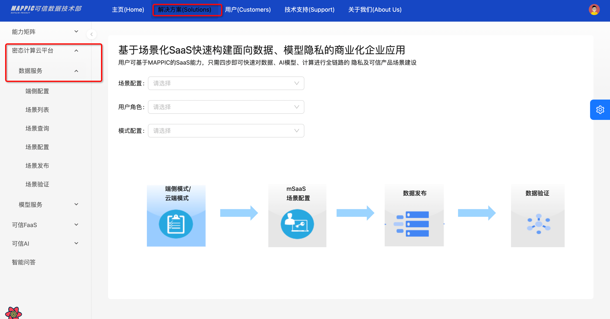

## 部署密态机密计算云平台（MAPPIC）
### 创建流程

1. 单击[部署链接](https://computenest.console.aliyun.com/service/instance/create/cn-hangzhou?spm=5176.24779694.0.0.36be4d22zpKKq3&type=user&ServiceId=service-ae7e12bcabc840f1bf14&isTrial=true)
2. 进入开通配置界面按照我们推荐的[机器规格]() 依次填写完服务实例名称，选择地域，付费类型，数据库的账号密码，集群的配置以及网络的配置并点击**确认订单**


 

3. 确认订单页会显示缺少的权限、基础配置和账单，建议申请完缺失的权限后再点击立即创建则进入创建环节


4. 点击查看已创建的实例


### 机器规格（TB级数据规模推荐）
**ACK集群**
规格：

- 32C、256G内存每台
- EPC：128G，明文：128G
- 2台ecs
- 操作系统 Alibaba Cloud Linux 2.1903 LTS 64位 (Hunting Beagle)
- 实例规格 [ecs.r7t.16xlarge](https://www.alibabacloud.com/help/doc-detail/25378.htm#r7t)

更多商业化规格配置参考请进群咨询！！！

**mysql**

| 版本 | 存储容量 | cpu规格 | 最大连接数 | 时区  |
| --- | ------- | ------- | -------- |-----|
| 8.0 | 100g | 1c 2g | 2000 | 0   |

**redis**

| 版本 | cpu规格 | 备注       |
| ---- | ---- |----------|
| 5.0 | 1c 2g | 最低标准，可升级 |

### 管理资源

1. 点击服务实例，进入后可以看到服务详情，等待创建完成，整个流程约20分钟


2. 点击查看资源mysql、redis和ecs等实例，并进行维护


## 快速体验
### 确认服务部署成功
进入计算巢服务后，选择【我的服务】-> 【服务实例】查看所有目前保有的实例

### 查看对外服务ip

### 配置用户oss地址（必须）
默认租户名称为 idatahub_KR_PROD_AMKTW3SG

修改oss的地址为用户自己的oss

修改点一：修改属性spark_config中的 如下属性

- **ossEndpoint**:用户自己的oss地址
- **ossAccessKeyId**:
- **ossAccessKeySecret**:

修改点二：修改属性oss_config中的如下字段：

- mainDevOssEp: oss地址
- mainDevOssBucketName:  执行计划上传的bucketName
- mainDevOssFilePath: 执行计划上传的路径，默认是 dev/
- mainDevOssAccessKeyId:
- mainDevOssAccessKeySecret:
- mappicOssBucketName: 日志上传的bucketName
- mainDevOssLogFilePath: 任务执行的日志存储路径，默认是 dev/log
- mappicOssAccessKeyId:
- mappicOssAccessKeySecret:
通过如下接口更新租户oss配置
```java
curl -X POST -d  '{"tenantId": "idatahub_KR_PROD_AMKTW3SG","ossEndpoint": "xxxxxxxx","ossAccessKeyId": "xxxxxxx","ossAccessKeySecret": "xxxxxxx","mainDevOssEp": "xxxxxxx","mainDevOssBucketName": "xxxxxxx","mainDevOssFilePath": "xxxxxxx","mainDevOssAccessKeyId": "xxxxxxx","mainDevOssAccessKeySecret": "xxxxxxx","mappicOssBucketName": "xxxxxxx","mainDevOssLogFilePath": "xxxxxxx","mappicOssAccessKeyId": "xxxxxxx","mappicOssAccessKeySecret": "xxxxxxx"}' --header 'Content-Type: application/json' --header 'Accept: */*' --header 'Connection: keep-alive' 'http://对外服务ip:8889/mappic/tenant/oss/update' 
```
### 接口接入
如下的 tenantId 入参皆为 上述中的 **租户名称 idatahub_KR_PROD_AMKTW3SG**
#### 可信应用初始化(必须执行)
```java
curl --location '对外服务ip:8889/api/antchain/installApp' \
--header 'Content-Type: application/json' \
--data '{
    "tappId":"mappic-vic",
    "tappVersion":1
}'
// 返回结果
{"filesName":null,"executeId":null,"executeMessage":"执行成功","failedReason":null,"successMessage":"app安装成功","object":null}
```
#### 创建元数据
创建输入表
```java
curl --location --request POST '对外服务ip:8889/mappic/datameta' \
--header 'Content-Type: application/json' \
--header 'Accept: */*' \
--header 'Connection: keep-alive' \
--data '{
    "tenantId": "idatahub_KR_PROD_AMKTW3SG",
    "tableMetas": [
        {
            "tableName": "fred_test_table22",
            "instId": "bfaa0186c7914119bf23ed0f30b4d4b6",
            "encryptKey": null,
            "storageInfo": "oss://mappic-dev/endToEnd/fred_test_table22",
            "isEncrypted": false,
            "partitionPattern": null,
            "isTemp": false,
            "columnInfo": [{"columnName":"event_id","isEncrypted":false},{"columnName":"event_link_id","isEncrypted":false},{"columnName":"merchant_id","isEncrypted":false},{"columnName":"merchant_name","isEncrypted":false},{"columnName":"user_id","isEncrypted":false},{"columnName":"gmt_occur","isEncrypted":false},{"columnName":"acq_site_id","isEncrypted":false},{"columnName":"acq_site_name","isEncrypted":false},{"columnName":"acq_site_event_amount","isEncrypted":false},{"columnName":"acq_site_event_currency","isEncrypted":false},{"columnName":"pay_site_id","isEncrypted":false},{"columnName":"pay_site_name","isEncrypted":false},{"columnName":"pay_site_user_id","isEncrypted":false},{"columnName":"pay_site_event_amount","isEncrypted":false},{"columnName":"pay_site_event_currency","isEncrypted":false},{"columnName":"gn_payment_id","isEncrypted":false},{"columnName":"gn_event_amount","isEncrypted":false},{"columnName":"gn_site_user_id","isEncrypted":false},{"columnName":"payment_scenario","isEncrypted":false},{"columnName":"is_in_store_payment","isEncrypted":false},{"columnName":"campaign_id","isEncrypted":false},{"columnName":"campaign_type","isEncrypted":false},{"columnName":"campaign_name","isEncrypted":false},{"columnName":"campaign_status","isEncrypted":false},{"columnName":"begin_time","isEncrypted":false},{"columnName":"end_time","isEncrypted":false},{"columnName":"promo_amount","isEncrypted":false},{"columnName":"promo_currency","isEncrypted":false},{"columnName":"gn_promo_amount","isEncrypted":false},{"columnName":"promo_type","isEncrypted":false},{"columnName":"promo_source","isEncrypted":false},{"columnName":"promo_result","isEncrypted":false},{"columnName":"promo_stage","isEncrypted":false},{"columnName":"coupon_id","isEncrypted":false},{"columnName":"order_title","isEncrypted":false},{"columnName":"result_message","isEncrypted":false},{"columnName":"error_message","isEncrypted":false},{"columnName":"event_properties","isEncrypted":false},{"columnName":"refund_status","isEncrypted":false},{"columnName":"acq_payment_amt","isEncrypted":false},{"columnName":"pay_result","isEncrypted":false},{"columnName":"pay_result_message","isEncrypted":false},{"columnName":"refund_amt","isEncrypted":false},{"columnName":"order_succ","isEncrypted":false},{"columnName":"decision_rule_id","isEncrypted":false},{"columnName":"psp_decision","isEncrypted":false},{"columnName":"psp_riskinfo","isEncrypted":false},{"columnName":"play_id","isEncrypted":false},{"columnName":"apt_gn_site_user_id","isEncrypted":false},{"columnName":"dt","isEncrypted":false}]
        }
    ]
}'
```
创建输出表
```java
curl --location --request POST 'http://对外服务ip:8889/mappic/datameta' \
--header 'Content-Type: application/json' \
--header 'Accept: */*' \
--header 'Connection: keep-alive' \
--data-raw '{
    "tenantId": "idatahub_KR_PROD_AMKTW3SG",
    "tableMetas": [
        {
            "tableName": "adm_ctu_app_gn_multi_data_collect_di",
            "instId": "bfaa0186c7914119bf23ed0f30b4d4b6",
            "encryptKey": null,
            "storageInfo": "oss://mappic-dev/yuxia/gj_test/adm_ctu_app_gn_multi_data_collect_di",
            "isEncrypted": false,
            "partitionPattern": null,
            "isTemp": false,
            "columnInfo": [{"columnName":"event_id","isEncrypted":false},{"columnName":"event_link_id","isEncrypted":false},{"columnName":"merchant_id","isEncrypted":false},{"columnName":"merchant_name","isEncrypted":false},{"columnName":"user_id","isEncrypted":false},{"columnName":"gmt_occur","isEncrypted":false},{"columnName":"acq_site_id","isEncrypted":false},{"columnName":"acq_site_name","isEncrypted":false},{"columnName":"acq_site_event_amount","isEncrypted":false},{"columnName":"acq_site_event_currency","isEncrypted":false},{"columnName":"pay_site_id","isEncrypted":false},{"columnName":"pay_site_name","isEncrypted":false},{"columnName":"pay_site_user_id","isEncrypted":false},{"columnName":"pay_site_event_amount","isEncrypted":false},{"columnName":"pay_site_event_currency","isEncrypted":false},{"columnName":"gn_payment_id","isEncrypted":false},{"columnName":"gn_event_amount","isEncrypted":false},{"columnName":"gn_site_user_id","isEncrypted":false},{"columnName":"payment_scenario","isEncrypted":false},{"columnName":"is_in_store_payment","isEncrypted":false},{"columnName":"campaign_id","isEncrypted":false},{"columnName":"campaign_type","isEncrypted":false},{"columnName":"campaign_name","isEncrypted":false},{"columnName":"campaign_status","isEncrypted":false},{"columnName":"begin_time","isEncrypted":false},{"columnName":"end_time","isEncrypted":false},{"columnName":"promo_amount","isEncrypted":false},{"columnName":"promo_currency","isEncrypted":false},{"columnName":"gn_promo_amount","isEncrypted":false},{"columnName":"promo_type","isEncrypted":false},{"columnName":"promo_source","isEncrypted":false},{"columnName":"promo_result","isEncrypted":false},{"columnName":"promo_stage","isEncrypted":false},{"columnName":"coupon_id","isEncrypted":false},{"columnName":"order_title","isEncrypted":false},{"columnName":"result_message","isEncrypted":false},{"columnName":"error_message","isEncrypted":false},{"columnName":"event_properties","isEncrypted":false},{"columnName":"refund_status","isEncrypted":false},{"columnName":"acq_payment_amt","isEncrypted":false},{"columnName":"pay_result","isEncrypted":false},{"columnName":"pay_result_message","isEncrypted":false},{"columnName":"refund_amt","isEncrypted":false},{"columnName":"order_succ","isEncrypted":false},{"columnName":"decision_rule_id","isEncrypted":false},{"columnName":"psp_decision","isEncrypted":false},{"columnName":"psp_riskinfo","isEncrypted":false},{"columnName":"play_id","isEncrypted":false},{"columnName":"apt_gn_site_user_id","isEncrypted":false},{"columnName":"dt","isEncrypted":false}]
        }
    ]
}'
```
#### 提交任务，获取任务实例
```java
curl --location 'http://对外服务ip:8889/mappic/task/template' \
--header 'Content-Type: application/json' \
--header 'Accept: */*' \
--header 'Connection: keep-alive' \
--data '{
    "tenantId":"idatahub_KR_PROD_AMKTW3SG",
    "sql":"select * from adm_ctu_app_gn_multi_data_collect_di limit 1000",
    "config":{},
    "inputTables":["bfaa0186c7914119bf23ed0f30b4d4b6.adm_ctu_app_gn_multi_data_collect_di"],
    "outputTable":"bfaa0186c7914119bf23ed0f30b4d4b6.fred_test_table22",
    "priorityLevel":1,
    "baseConfig":{
        "name":"yuxia-test-18781",
        "instId":"bfaa0186c7914119bf23ed0f30b4d4b6",
        "jobId":"yuxia-test-482",
        "timestamp":"2023-11-14 11:28:30",
        "env":"DEV"
    }
}'
```
#### 查看执行情况
##### 方式一: 接口查看
任务日志的taskInstanceId需要输入的是创建任务时返回的
```json
curl --location 'localhost:8889/mappic/task/log?taskInstanceId=任务实例&tenantId=idatahub_KR_PROD_AMKTW3SG&logWindowSecs=1'

// 查询日志返回结果
{"errorCode":null,"errorMessage":null,"status":null,"data":{"logPath":"oss://mappic-dev/dev/log/yuxia-test-187812121bfaa0186c7914119bf23ed0f30b4d4b6idatahub_KR_PROD_AMKTW3SG1025757126413094744.log"},"success":true}
```
```json
curl --location 'localhost:8889/mappic/task/detail?taskInstanceId=任务实例id&tenantId=idatahub_KR_PROD_AMKTW3SG&env=DEV'

// 查询任务详情返回结果
{"errorCode":null,"errorMessage":null,"status":null,"data":{"taskInstanceId":"yuxia-test-187812121bfaa0186c7914119bf23ed0f30b4d4b6idatahub_KR_PROD_AMKTW3SG","ossPath":"oss://mappic-dev/endToEnd/fred_test_table22"},"success":true}
```
```json
curl --location 'localhost:8889/mappic/task/status/list' \
--header 'Content-Type: application/json' \
--data '{
    "tenantId": "idatahub_KR_PROD_AMKTW3SG",
    "taskInstanceIds": ["任务的实例"]
}'

// 查询任务状态返回结果
{"errorCode":null,"errorMessage":null,"status":null,"data":{"statusDetail":[{"taskInstanceId":"yuxia-test-187812121bfaa0186c7914119bf23ed0f30b4d4b6idatahub_KR_PROD_AMKTW3SG","status":"RUNNING","startTime":"1715602501000","currentTime":"1715603076530"}]},"success":true}
```
##### 方式二：控制台查看 执行状态
step1: 根据任务实例id查看 任务容器标签id，即：job_id
```sql
SELECT a.id, a.`sql`,
       a.`status`,
       a.`request_id`,
       b.`status`,
       a.`input_tables`,
       a.`output_table`,
       b.`mytf_request_id`,
       a.`create_time`,
       b.`gmt_finish`,
       c.`job_id`, // 任务容器的标签id
a.`spark_args` 
  FROM `task_table` AS a LEFT JOIN `async_tapp_request` AS b ON a.`request_id`= b.`request_id` LEFT JOIN `request_task_relation_table` AS c
 ON b.`mytf_request_id`= c.`task_id` 
WHERE a.`sql` NOT LIKE "LOAD%" 
   AND a.`instance_id` = "任务实例id"
 ORDER BY a.`id` DESC 
LIMIT 200;
```
step2：查看ack集群->点击工作负载->容器组->切换命名空间为default->按标签查询
查询：**mss_job_id= 查出来的job_id（去除最后一个字符）**

### 网页体验(仅用于体验非商业化版本)
登录页面

登录主页

密态数据分析场景(数据提供方)

密态数据分析场景（数据使用方)


#### 更多平台体验链接
进群联系管理员 @霖珂和@冬雪
# 联系我们
1.联系邮箱：antchainmappic@service.alipay.com

2.快速问题排查：可通过技术交流群和我们进行联系，详见下面二位码：

MAPPIC钉钉交流群：


MAPPIC微信交流群：


