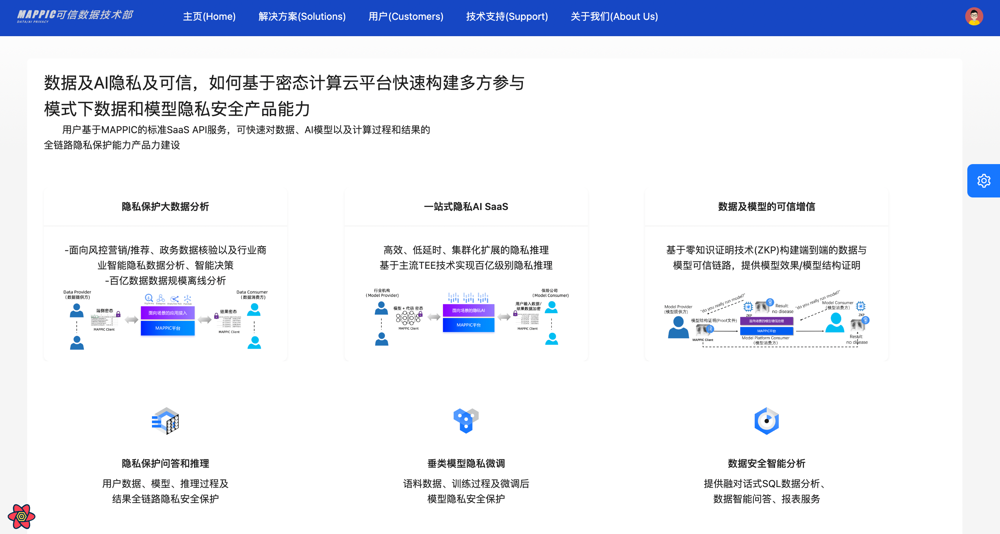

# 部署密态计算云平台（MAPPIC）

## 概述
MAPPIC是蚂蚁数科面向海量数据和模型隐私保护的密态计算平台，MAPPIC在计算巢上提供了体验版本，您无需自行购置云主机，即可在计算巢上快速部署并体验MAPPIC服务、实现运维监控，从而搭建您自己的隐私保护应用。

基础能力包括：隐私保护AI/BI、TEE模式的大模型隐私保护推理、微调；同时我们兼容了多种数据和AI开源框架，如Spark、ipex-llm、PyTorch、DeepSpeed等。当然您也可以基于MAPPIC快速构建数据沙箱、可信数据空间等密态场景计算模式。

目前MAPPIC提供免费使用版本，欢迎大家申请试用，有任何问题欢迎反馈交流。
## 实例规格（TB级数据规模推荐）
**ACK集群**

规格：

- 4C、32G内存每台
- EPC：48G，明文：48G
- 3台ecs
- 操作系统 Alibaba Cloud Linux 2.1903 LTS 64位 (Hunting Beagle)
- 实例规格 [ecs.r7t.xlarge](https://www.alibabacloud.com/help/doc-detail/25378.htm#r7t)

更多商业化规格配置参考请进群咨询！！！

**mysql**

| 版本 | 存储容量 | cpu规格 | 最大连接数 | 时区  |
| --- | ------- | ------- | -------- |-----|
| 8.0 | 100g | 1c 2g | 2000 | 0   |

**redis**

| 版本 | cpu规格 | 备注       |
| ---- | ---- |----------|
| 5.0 | 1c 2g | 最低标准，可升级 |

## 部署流程
### 0.准备工作

在申请试用之前，您需要准备一个阿里云账号，对ECS、VPC、ROS、ACK、REDIS、RDS等资源进行访问和创建操作。

- 若您使用主账号，可以直接创建服务实例
- 若您使用RAM用户创建服务实例，且是第一次使用阿里云计算巢，需要在创建服务实例前，对使用的RAM用户的账号添加相应资源的权限。

### 1.部署入口
&nbsp;&nbsp;您可以再阿里云的计算巢中通过 **MAPPIC** 关键字进行搜索，也可以单击下述链接快速体验

&nbsp;&nbsp;单击[部署链接](https://computenest.console.aliyun.com/service/instance/create/cn-hangzhou?spm=5176.24779694.0.0.36be4d22zpKKq3&type=user&ServiceId=service-ae7e12bcabc840f1bf14&isTrial=true)

### 2.申请试用
在使用之前，请按照提示信息完成申请，在审核通过之后就可以创建服务


### 3.创建服务
- 进入开通配置界面按照我们推荐的[机器规格] 依次填写完服务实例名称，选择地域，付费类型，数据库的账号密码，集群的配置以及网络的配置并点击**确认订单**


- 确认订单页会显示缺少的权限、基础配置和账单，建议申请完缺失的权限后再点击立即创建则进入创建环节


- 点击查看已创建的实例


## 管理资源

- 点击服务实例，进入后可以看到服务详情，等待创建完成，整个流程约20分钟


- 点击查看资源mysql、redis和ecs等实例，并进行维护


## 快速体验
**1.确认服务部署结果**

进入计算巢服务后，选择【我的服务】-> 【服务实例】查看所有目前保有的实例


**2.查看对外服务ip**


**3.默认定义(体验版本不支持修改)**

| 定义 | 描述 |
| -- | ------- |
| tenantId | 租户名称: **mappic_confidential_cloud_computing** |

**4.配置用户oss地址（必须)**

修改oss的地址为用户自己的oss

**修改点一：修改属性spark_config中的 如下属性**

| 字段名称 | 字段含义 |
| -- | ------- |
| ossEndpoint | 用户自己的oss地址 |
| ossAccessKeyId | 用户自己oss地址AK |
| ossAccessKeySecret | 用户自己oss地址SK |

**修改点二：修改属性oss_config中的如下字段:**

| 字段名称 | 字段含义 |
| -- | ------- |
| mainDevOssEp | 用户自己的oss地址 |
| mainDevOssBucketName | 执行计划上传的bucketName |
| mainDevOssFilePath | 执行计划上传的路径 |
| mainDevOssAccessKeyId | oss的AK |
| mainDevOssAccessKeySecret | oss的SK |
| mappicOssBucketName | 日志上传的bucketName |
| mainDevOssLogFilePath | 任务执行的日志存储路径 |
| mappicOssAccessKeyId | oss的AK |
| mappicOssAccessKeySecret | oss的SK |

&nbsp;&nbsp;&nbsp;&nbsp;通过如下接口更新租户oss配置

```java
curl -X POST -d  '{"tenantId": "mappic_confidential_cloud_computing","ossEndpoint": "xxxxxxxx","ossAccessKeyId": "xxxxxxx","ossAccessKeySecret": "xxxxxxx","mainDevOssEp": "xxxxxxx","mainDevOssBucketName": "xxxxxxx","mainDevOssFilePath": "xxxxxxx","mainDevOssAccessKeyId": "xxxxxxx","mainDevOssAccessKeySecret": "xxxxxxx","mappicOssBucketName": "xxxxxxx","mainDevOssLogFilePath": "xxxxxxx","mappicOssAccessKeyId": "xxxxxxx","mappicOssAccessKeySecret": "xxxxxxx"}' \
    --header 'Content-Type: application/json' \
    --header 'Accept: */*' \
    --header 'Connection: keep-alive' \
    'http://对外服务ip:8889/mappic/tenant/oss/update' 
```

**5.接口接入**

如下的**tenantId**入参皆为上述中的**租户名称：mappic_confidential_cloud_computing**

**step1: 可信应用初始化(必须执行)**

```java
curl --location '对外服务ip:8889/api/antchain/installApp' \
    --header 'Content-Type: application/json' \
    --data '{
    "tappId":"mappic-vic",
    "tappVersion":1
    }'

    // 返回结果
    {"filesName":null,"executeId":null,"executeMessage":"执行成功","failedReason":null,"successMessage":"app安装成功","object":null}
```

**step2: 创建元数据**

创建输出表

```java
curl --location --request POST '对外服务ip:8889/mappic/datameta' \
    --header 'Content-Type: application/json' \
    --header 'Accept: */*' \
    --header 'Connection: keep-alive' \
    --data '{
    "tenantId": "mappic_confidential_cloud_computing",
    "tableMetas": [
    {
    "tableName": "fred_test_table22",
    "instId": "bfaa0186c7914119bf23ed0f30b4d4b6",
    "encryptKey": null,
    "storageInfo": "oss://mappic-dev/endToEnd/fred_test_table22",
    "isEncrypted": false,
    "partitionPattern": null,
    "isTemp": false,
    "columnInfo": [{"columnName":"event_id","isEncrypted":false},{"columnName":"event_link_id","isEncrypted":false},{"columnName":"merchant_id","isEncrypted":false},{"columnName":"merchant_name","isEncrypted":false},{"columnName":"user_id","isEncrypted":false},{"columnName":"gmt_occur","isEncrypted":false},{"columnName":"acq_site_id","isEncrypted":false},{"columnName":"acq_site_name","isEncrypted":false},{"columnName":"acq_site_event_amount","isEncrypted":false},{"columnName":"acq_site_event_currency","isEncrypted":false},{"columnName":"pay_site_id","isEncrypted":false},{"columnName":"pay_site_name","isEncrypted":false},{"columnName":"pay_site_user_id","isEncrypted":false},{"columnName":"pay_site_event_amount","isEncrypted":false},{"columnName":"pay_site_event_currency","isEncrypted":false},{"columnName":"gn_payment_id","isEncrypted":false},{"columnName":"gn_event_amount","isEncrypted":false},{"columnName":"gn_site_user_id","isEncrypted":false},{"columnName":"payment_scenario","isEncrypted":false},{"columnName":"is_in_store_payment","isEncrypted":false},{"columnName":"campaign_id","isEncrypted":false},{"columnName":"campaign_type","isEncrypted":false},{"columnName":"campaign_name","isEncrypted":false},{"columnName":"campaign_status","isEncrypted":false},{"columnName":"begin_time","isEncrypted":false},{"columnName":"end_time","isEncrypted":false},{"columnName":"promo_amount","isEncrypted":false},{"columnName":"promo_currency","isEncrypted":false},{"columnName":"gn_promo_amount","isEncrypted":false},{"columnName":"promo_type","isEncrypted":false},{"columnName":"promo_source","isEncrypted":false},{"columnName":"promo_result","isEncrypted":false},{"columnName":"promo_stage","isEncrypted":false},{"columnName":"coupon_id","isEncrypted":false},{"columnName":"order_title","isEncrypted":false},{"columnName":"result_message","isEncrypted":false},{"columnName":"error_message","isEncrypted":false},{"columnName":"event_properties","isEncrypted":false},{"columnName":"refund_status","isEncrypted":false},{"columnName":"acq_payment_amt","isEncrypted":false},{"columnName":"pay_result","isEncrypted":false},{"columnName":"pay_result_message","isEncrypted":false},{"columnName":"refund_amt","isEncrypted":false},{"columnName":"order_succ","isEncrypted":false},{"columnName":"decision_rule_id","isEncrypted":false},{"columnName":"psp_decision","isEncrypted":false},{"columnName":"psp_riskinfo","isEncrypted":false},{"columnName":"play_id","isEncrypted":false},{"columnName":"apt_gn_site_user_id","isEncrypted":false},{"columnName":"dt","isEncrypted":false}]
    }
    ]
    }'
```

创建输入表

```java
curl --location --request POST 'http://对外服务ip:8889/mappic/datameta' \
    --header 'Content-Type: application/json' \
    --header 'Accept: */*' \
    --header 'Connection: keep-alive' \
    --data-raw '{
    "tenantId": "mappic_confidential_cloud_computing",
    "tableMetas": [
    {
    "tableName": "adm_ctu_app_gn_multi_data_collect_di", // 表名
    "instId": "bfaa0186c7914119bf23ed0f30b4d4b6", // 机构id
    "encryptKey": null,
    "storageInfo": "xxxxx",
    "isEncrypted": false,
    "partitionPattern": null,
    "isTemp": false,
    "columnInfo": [
    {
    "columnName":"event_id",
    "isEncrypted":false
    }
    ]
    }
    ]
    }'
```
**step:3 提交任务，获取任务实例**

```java
curl --location 'http://对外服务ip:8889/mappic/task/template' \
    --header 'Content-Type: application/json' \
    --header 'Accept: */*' \
    --header 'Connection: keep-alive' \
    --data '{
    "tenantId":"mappic_confidential_cloud_computing",
    "sql":"select * from adm_ctu_app_gn_multi_data_collect_di limit 1000",
    "config":{},
    "inputTables":["bfaa0186c7914119bf23ed0f30b4d4b6.adm_ctu_app_gn_multi_data_collect_di"],// 机构id·表名的结构
    "outputTable":"bfaa0186c7914119bf23ed0f30b4d4b6.fred_test_table22",
    "priorityLevel":1,
    "baseConfig":{
    "name":"xxx",
    "instId":"bfaa0186c7914119bf23ed0f30b4d4b6",
    "jobId":"xxxx",
    "timestamp":"2023-11-14 11:28:30",
    "env":"DEV"
    }
    }'
```

**step4: 查看执行情况**

- **方式一: 通过接口查看**

任务日志的**taskInstanceId**需要输入的是创建任务时返回的
```json
curl --location 'localhost:8889/mappic/task/log?taskInstanceId=任务实例&tenantId=mappic_confidential_cloud_computing&logWindowSecs=1'

// 查询日志返回结果
{
  "errorCode":null,
  "errorMessage":null,
  "status":null,
  "data":{
    "logPath":"xxxxxx"
  },
  "success":true
}
```
```json
curl --location 'localhost:8889/mappic/task/detail?taskInstanceId=任务实例id&tenantId=mappic_confidential_cloud_computing&env=DEV'

// 查询任务详情返回结果
{
  "errorCode":null,
  "errorMessage":null,
  "status":null,
  "data":{
    "taskInstanceId":"你的实例id",
    "ossPath":"xxxx"
  },
  "success":true
}
```
```json
curl --location 'localhost:8889/mappic/task/status/list' \
--header 'Content-Type: application/json' \
--data '{
"tenantId": "mappic_confidential_cloud_computing",
"taskInstanceIds": ["任务的实例"]
}'

// 查询任务状态返回结果
{
"errorCode":null,
"errorMessage":null,
"status":null,
"data":{
"statusDetail":[
{
"taskInstanceId":"xxxxxx",
"status":"RUNNING",
"startTime":"1715602501000",
"currentTime":"1715603076530"
}
]
},
"success":true
}
```

- **方式二：控制台查看 执行状态**

step1: 根据任务实例id查看 任务容器标签id，即：job_id
```sql
SELECT a.id, a.`sql`,a.`status`,a.`request_id`,b.`status`,a.`input_tables`,a.`output_table`,
       b.`mytf_request_id`,a.`create_time`,b.`gmt_finish`,c.`job_id`,a.`spark_args` 
FROM `task_table` AS a LEFT JOIN `async_tapp_request` AS b ON a.`request_id`= b.`request_id` 
LEFT JOIN `request_task_relation_table` AS c
ON b.`mytf_request_id`= c.`task_id` 
WHERE a.`sql` NOT LIKE "LOAD%" 
AND a.`instance_id` = "任务实例id"
ORDER BY a.`id` DESC 
LIMIT 200;
```

step2：查看ack集群->点击工作负载->容器组->切换命名空间为default->按标签查询

查询：**mss_job_id= 查出来的job_id（去除最后一个字符）**


### 网页体验(仅用于体验非商业化版本)
**登录页面**


**登录主页**



**密态数据分析场景(数据提供方)**


**密态数据分析场景（数据使用方)**


#### 更多平台体验链接
进群联系管理员 **@霖珂和@冬雪**
# 联系我们
- **联系邮箱**：antchainmappic@service.alipay.com

- **快速问题排查**：可通过技术交流群和我们进行联系，详见下面二维码：

**MAPPIC钉钉交流群**：


**MAPPIC微信交流群**：


